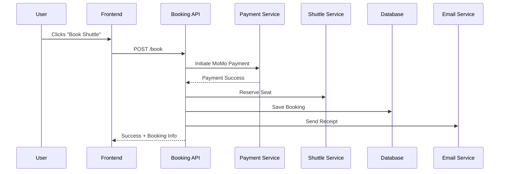

# 🚍 Shuttle Booking System

This is a shuttle booking system built to streamline and modernize the shuttle process at my school. Instead of relying on manual lists or word-of-mouth, students can now book their shuttle seats easily through a web application — with instant payments and email confirmations.

---

## 🧠 Purpose

The aim of this project is to **simplify** and **digitize** the shuttle booking process on campus, allowing students to:

- Browse available shuttles
- Book seats in advance
- Pay using MTN MoMo
- Receive email receipts instantly
- And avoid overbooking or missing their ride

---

## 🛠️ Tech Stack

| Layer        | Technology                        |
| ------------ | --------------------------------- |
| **Backend**  | Node.js, Express.js               |
| **Auth**     | JWT-based Authentication          |
| **Payments** | MTN MoMo API (Sandbox)            |
| **Email**    | Nodemailer                        |
| **Database** | MySQL with Prisma ORM             |
| **Frontend** | _(planned)_ React.js _(or other)_ |

---

## 📦 Features

✅ JWT Authentication
✅ MTN MoMo Payment Integration
✅ Email Receipts on Booking
✅ Shuttle Creation & Management
✅ Seat Tracking & Auto-Status (`full`, `departed`)
✅ Admin Dashboard _(coming soon)_

---

## 🧩 Architecture Overview

This system is built as **modular services**:

- **Auth Service** — handles registration/login with JWT
- **Booking Service** — processes bookings, coordinates payment & shuttles
- **Shuttle Service** — manages all shuttle buses, routes, capacity, etc.
- **Payment Service** — integrates MoMo STK Push
- **Email Service** — sends receipts via Nodemailer

Each service can run independently or be wired together via an **API Gateway**.

---

## 💳 Booking Flow (Simplified)

